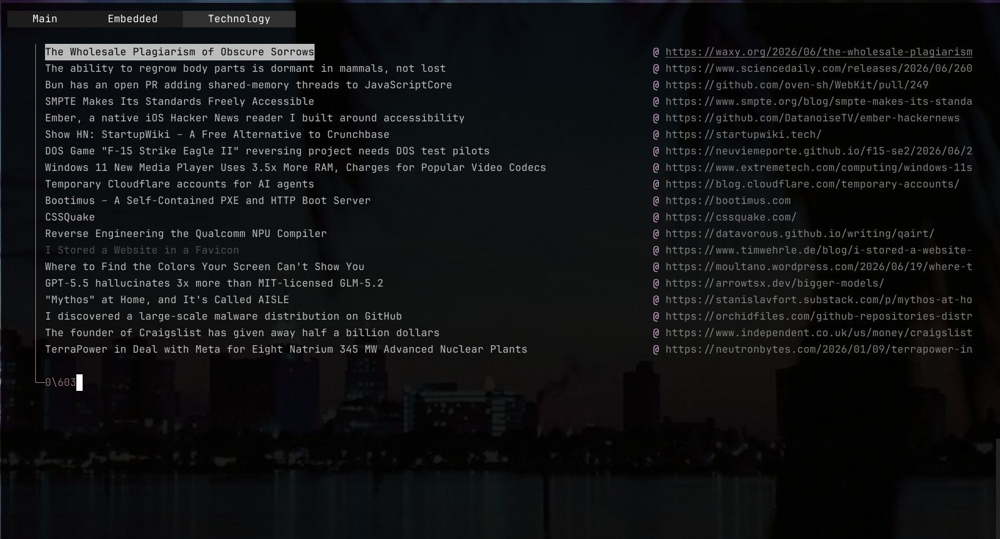

# Koala News 🐨



**Koala News** is a minimalist, keyboard-driven terminal feed reader designed for Windows. It features a fast C-based client (`news.exe`) with tabbed browsing and a C++ feed fetcher that uses `libcurl` and `rapidxml` to parse RSS and Atom feeds.

---

## Features

- **Keyboard-Centric UI:** Vim-like keyboard navigation (`j`/`k`/`gg`) and Unix-style commands.
- **Tabbed Interface:** Read feeds in multiple tabs, group items by category, or filter them by source domain.
- **Smart Media Launcher:** Clicking entries opens standard URLs in your default browser, while video/YouTube URLs automatically launch directly in **mpv** for seamless terminal viewing.
- **Expanded & Standard Layouts:** Automatically switches between single-column and dual-column layouts based on terminal window resizing.
- **Custom Categorization:** Organize RSS/Atom feeds into custom group tabs (e.g., tech, sports, world).
- **Blacklists:** Filter out feed items dynamically using URL-based and word-based exclusion rules.
- **SQLite-Free Storage:** Fast loading utilizing flat files stored in AppData.

---

## Directory Structure

- [client/](file:///C:/Users/gsppe/wezterm/news/project_files/client/) — Source files for the terminal client interface.
  - [client/main.c](file:///C:/Users/gsppe/wezterm/news/project_files/client/main.c) — Main application entry, window resizing loop, and input handling.
  - [client/ui.c](file:///C:/Users/gsppe/wezterm/news/project_files/client/ui.c) — Renders the dual-pane or single-pane list and tab headers.
  - [client/nav.c](file:///C:/Users/gsppe/wezterm/news/project_files/client/nav.c) — Navigation logic for list selector operations.
  - [client/tabs.c](file:///C:/Users/gsppe/wezterm/news/project_files/client/tabs.c) — Core tab management logic.
  - [client/cmd.c](file:///C:/Users/gsppe/wezterm/news/project_files/client/cmd.c) — Parses commands executed from command mode.
  - [client/loadfiles.c](file:///C:/Users/gsppe/wezterm/news/project_files/client/loadfiles.c) — Loads the entry data and handles read/unread flags.
- [server/](file:///C:/Users/gsppe/wezterm/news/project_files/server/) — Source files for the feed updater daemon/backend.
  - [server/koalaServer.cpp](file:///C:/Users/gsppe/wezterm/news/project_files/server/koalaServer.cpp) — Command-line interface for updating feeds or running tests.
  - [server/feed.cpp](file:///C:/Users/gsppe/wezterm/news/project_files/server/feed.cpp) — Fetches feeds using `libcurl` and processes parsed output.
  - [server/blacklist.cpp](file:///C:/Users/gsppe/wezterm/news/project_files/server/blacklist.cpp) — Word- and URL-filtering logic.
  - [server/groups.cpp](file:///C:/Users/gsppe/wezterm/news/project_files/server/groups.cpp) — Reads and structures custom categorization groups.

---

## Compilation

Both components are compiled using GCC/G++ on Windows.

### 1. Compiling the Client
Navigate to the [client/](file:///C:/Users/gsppe/wezterm/news/project_files/client/) directory and run `compile.bat`:
```cmd
cd client
compile.bat
```
This runs:
```cmd
gcc -c main.c cmd.c colorscheme.c loadfiles.c nav.c tabs.c ui.c -I.
gcc main.o cmd.o colorscheme.o loadfiles.o nav.o tabs.o ui.o -o news.exe -lpthread -lshell32
```

### 2. Compiling the Server
Navigate to the [server/](file:///C:/Users/gsppe/wezterm/news/project_files/server/) directory and run `compile.bat`:
```cmd
cd server
compile.bat
```
This runs:
```cmd
g++ -o koalaServer koalaServer.cpp files_path.cpp blacklist.cpp groups.cpp feed.cpp utils.cpp -IC:\MinGW\include\ -lcurl -lshell32
```

---

## Configuration & Usage

The application reads and saves its settings in the Windows AppData directory at:
`%APPDATA%\kNews\` (usually `C:\Users\<YourUsername>\AppData\Roaming\kNews\`)

### 1. Registering Groups (`user_groups.conf`)
Create or edit `%APPDATA%\kNews\user_groups.conf` to declare custom categories:
```text
@groups
register-group 1 Tech
register-group 2 News
register-group 3 Video
```

### 2. Adding Feeds (`webfeeds.conf`)
Create or edit `%APPDATA%\kNews\webfeeds.conf` to list your RSS/Atom feeds, mapping them to groups if desired:
```text
https://news.ycombinator.com/rss [Tech,News]
https://www.youtube.com/feeds/videos.xml?channel_id=UCsBjURrdUwZs3IHrMcna1QG [Video]
```

### 3. Blacklisting Content (`blacklisted.conf`)
Filter out articles containing specific words or originating from certain URLs:
```text
@blacklisted_urls
clickbait-site.com

@blacklisted_words
spoilers
giveaway
```

### 4. Fetching Feeds
Run the parser executable to fetch the newest articles:
```cmd
koalaServer.exe
```
This will parse the feeds, check them against the blacklist, sort them by publication date, and append them to `entries.dat`.
*To test a local feed configuration file:* `koalaServer.exe test example.atom`.

### 5. Launching the Reader
Run `news.exe` to open the terminal reader:
```cmd
news.exe
```

---

## Keyboard Controls & Navigation

### List Navigation
- <kbd>j</kbd> — Move selection down by 1 item.
- <kbd>k</kbd> — Move selection up by 1 item.
- <kbd>g</kbd> then <kbd>g</kbd> — Jump to the top of the list.
- <kbd>Page Up</kbd> — Page up by screen height.
- <kbd>Page Down</kbd> — Page down by screen height.

### Tab Controls
- <kbd>h</kbd> — Switch to the **previous** tab.
- <kbd>l</kbd> — Switch to the **next** tab.
- <kbd>u</kbd> — Open a new tab filtering by the highlighted entry's domain (URL base).
- <kbd>d</kbd> — Close the current tab (the base "Main" tab cannot be closed).

### Execution and Mode Keys
- <kbd>Enter</kbd> — Open highlighted entry.
  - Video URLs (e.g., YouTube, MP4) launch in **mpv**.
  - All other links launch in the default browser.
  - The entry is marked as seen in `%APPDATA%\kNews\int.dat`.
- <kbd>r</kbd> — Reload and refresh list from the database.
- <kbd>:</kbd> — Enter **Command Mode** (see below).
- <kbd>Q</kbd> — Save and quit the reader safely.

---

## Command Mode

Press <kbd>:</kbd> while viewing the feed to open the prompt:

- `:open-group <group_name>` (or `:g <group_name>`) — Opens a new tab containing only articles from the requested group category.
- <kbd>Tab</kbd> — Autocompletes the group name dynamically.
- <kbd>Backspace</kbd> — Erase character. Exits command mode if the buffer is empty.
- <kbd>Enter</kbd> — Run command.
